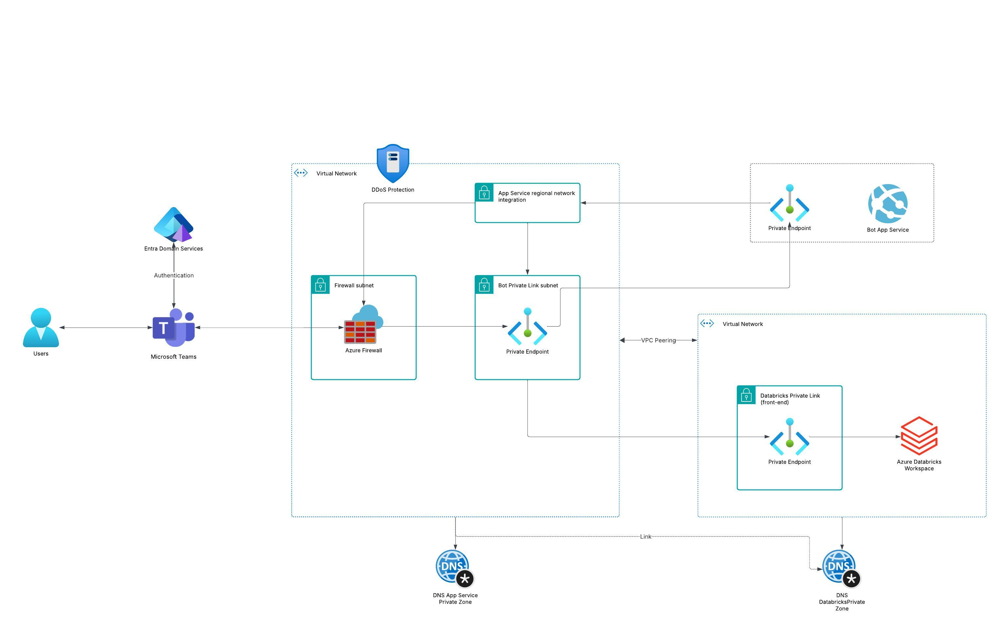

# Description
This repository demonstrates an example scenario that allows users to interact with a Bot based on a Genie Space using Microsoft Teams. It expands the following scenario: [Help secure your Microsoft Teams channel bot and web app behind a firewall](https://learn.microsoft.com/en-us/azure/architecture/example-scenario/teams/securing-bot-teams-channel) and, as the original, implements the pillars of the [Azure Well-Architected Framework](https://learn.microsoft.com/en-us/azure/well-architected/).

## Architecture

# Acknowledgement
The Bot code is based on this [repository](https://github.com/carrossoni/DatabricksGenieBOT/tree/main) authored by Luiz Carrossoni.  

# Pre-requisites
- An existing Databricks workspace with [Azure Private Link back-end and front-end connections](https://learn.microsoft.com/en-us/azure/databricks/security/network/classic/private-link) enabled with a [Genie Space](https://learn.microsoft.com/en-us/azure/databricks/genie/set-up) accessible via API.
- An environment with a Bash shell and a recent version of the Azure CLI installed. The Bash version of the [Azure Cloud Shell](https://azure.microsoft.com/en-us/get-started/azure-portal/cloud-shell) is an option. 

# Authentication
There are two authentication options from the Bot Application to the Genie API: an Azure Managed Identity or a Databricks Personal Access Token (PAT). The former is recommended and, if used, the environment variable `DATABRICKS_TOKEN` should be set to an empty string. Conversely, if using a PAT, set said variable appropriately. 

Once deployed, the authentication method can be changed by modifying the `DATABRICKS_TOKEN` environment variable in the Web App.

# Local Testing
The bot application can be tested and debugged locally. To do so, rename bot/env-sample to .env and replace the values with yours. The Bot Framework Emulator can be used as a client. Refer to this [link](https://learn.microsoft.com/en-us/azure/bot-service/bot-service-debug-emulator?view=azure-bot-service-4.0&tabs=python) for guidance. If using an Azure Managed Identity for authentication, ensure you are logged in to Azure (az login) with a user that has access to the Genie Space API. 

# Steps
- Clone this repo and change directory: `git clone https://github.com/maucaro/secure_bot.git && cd secure_bot`
- Locally test the Bot application (optional). 
- Rename `setenv-samples.sh` to `setenv.sh` and modify it with your values and to conform to your naming standards. 
- Search for 'TO DO:' in the repository's files and adjust as necessary.
- Run `initial.sh`
- Run `build.sh`
- Run `bot.sh`
- If using an Azure Managed Identity, ensure it has appropriate permissions to the Genie Space; refer to this [link](https://docs.databricks.com/aws/en/genie/set-up#required-permissions).
- Rename `appManifest\manifest-sample.json` to `appManifest\manifest.json` and update it with the ClientId of the Managed Identity (in the 'id' and and 'bots.botId' fiellds), and with your custom domain in 'validDomains'.
- Zip the files in the `appManifest` folder, upload the app to Teams and test it; if successful, continue.
- Run `network.sh`
- Map a custom domain for the Web App; add a DNS A record pointing the custom domain to the Firewall's public IP. 
- Run `private_endpoint.sh`
- Run `route_table.sh`
- Run `network_rules.sh`
- Run `peering.sh`
- Change Bot configuration's endpoint to the custom domain

# Limitations and areas for improvement
- If using PAT for authentication, Azure Key Vault should be used to store it.
- The Bot code only allows interactions from users in the configured Entra ID Tenant. For more granular control, organizations would need to manage access to the Teams App as described [here](https://learn.microsoft.com/en-us/microsoftteams/app-centric-management).
